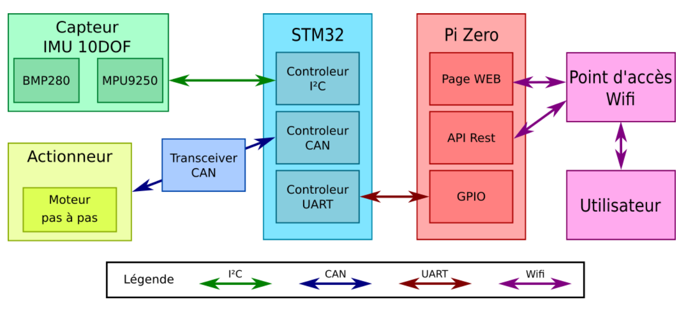

# TP Bus et Réseaux

## Introduction

Ce TP vise à mettre en place un système intégrant différents composants pour l'accès aux données des capteurs et le contrôle des actionneurs via une interface API REST. Voici une explication détaillée de l'architecture du système :

L'architecture du système :




1. La STM32 interroge les capteurs via le bus I²C et contrôle les actionneurs via le bus CAN.

2. Les données des capteurs et les informations de contrôle des actionneurs sont transmises à la Raspberry Pi via le bus UART.

3. La Raspberry Pi expose une interface API REST qui permet à d'autres dispositifs ou systèmes d'accéder aux données des capteurs et de contrôler les actionneurs.

4. Les utilisateurs ou d'autres systèmes peuvent interagir avec l'interface API REST de la Raspberry Pi 0 en effectuant des requêtes HTTP (GET, POST, etc.) sur les endpoints spécifiés.

5. En fonction des requêtes reçues, la Raspberry Pi communique avec la STM32 via le bus UART pour récupérer les données des capteurs ou envoyer des commandes de contrôle aux actionneurs.

# Acquisition de la température/pression par le BMP280

### Objectif

Interfacer un STM32 avec des un capteur I2C (BMP280)

## Architecture
Le driver BMP280 est structuré en plusieurs fonctions pour initialiser le capteur, récupérer les valeurs d'étalonnage, lire la température et la pression, et effectuer des opérations de compensation. Voici un aperçu des principales fonctions :

- `BMP280_init`: Cette fonction initialise le capteur BMP280 en configurant le mode de fonctionnement et les échantillonnages. Elle vérifie également l'ID du composant pour s'assurer qu'il s'agit bien d'un BMP280 ( 0x58 dans notre cas).

- `BMP280_etalonnage`: Cette fonction récupère les valeurs d'étalonnage à partir du capteur BMP280. Ces valeurs d'étalonnage sont essentielles pour la compensation des données de température et de pression.

- `BMP280_get_temp`: Cette fonction lit la température brute à partir du capteur, puis la compense en utilisant les valeurs d'étalonnage pour obtenir la température en degrés Celsius.

- `BMP280_get_pressure`: Cette fonction lit la pression brute à partir du capteur, puis la compense en utilisant les valeurs d'étalonnage pour obtenir la pression en Pascals.

## Utilisation
Pour utiliser le driver BMP280, suivez ces étapes :

1. Incluez le fichier d'en-tête `BMP280.h` dans votre code.

2. Initialisez une structure `h_BMP280_t` pour stocker les données du capteur et configurez la structure selon vos besoins.

3. Appelez la fonction `BMP280_init` pour initialiser le capteur.

4. Appelez la fonction `BMP280_etalonnage` pour récupérer les valeurs d'étalonnage du capteur.

5. Utilisez les fonctions `BMP280_get_temp` et `BMP280_get_pressure` pour lire la température et la pression.

# Interfaçage STM32 - Raspberry

### Objectif

Permettre l'interrogation du STM32 via un Raspberry Pi Zero

## Fonctionnalités principales

- **Récupération de la température (`GET_T`) :**
  - La Raspberry Pi envoie `GET_T`.
  - La STM32 récupère la température du capteur BMP280.
  - La STM32 renvoie la température à la Raspberry Pi.

- **Récupération de la pression (`GET_P`) :**
  - La Raspberry Pi envoie `GET_P`.
  - La STM32 récupère la pression du capteur BMP280.
  - La STM32 renvoie la pression à la Raspberry Pi.

- **Réglage du coefficient K (`SET_K=xxxx`) :**
  - La Raspberry Pi envoie `SET_K=xxxx` pour définir K.
  - La STM32 met à jour la valeur de K.

- **Récupération du coefficient K (`GET_K`) :**
  - La Raspberry Pi envoie `GET_K`.
  - La STM32 renvoie la valeur actuelle de K.

- **Récupération de l'angle (`GET_A`) :**
  - La Raspberry Pi envoie `GET_A`.
  - La STM32 renvoie la valeur de l'angle.

Le problème initial était une différence de vitesse entre la réception de caractères via Minicom (lente) et la transmission rapide via ser.write en Python. Cela entraînait parfois la perte de caractères pendant le traitement.

La solution adoptée est l'utilisation de `HAL_UARTEx_ReceiveToIdle_DMA(&huart4, RxBuffer, RX_BUFFER_SIZE)`. Cette fonction garantit que tous les caractères sont reçus avant le traitement, évitant ainsi la perte de données.   

# Bus CAN 

### Objectif

L'intégration d'un moteur pas-à-pas sur le bus CAN nécessite une configuration minutieuse des paramètres de communication. Voici les étapes clés de cette mise en place :

## Paramètres de Communication CAN

- **Baud Rate :** 500 kbits/s
- **Ratio seg2/(seg1+seg2) :** 87%
- **Prescaler :** 16
- **Seg1 :** 2 times
- **Seg2 :** 2 time

Ces paramètres ont été sélectionnés avec soin pour minimiser les erreurs de transmission.

## Utilisation du Tranceiver CAN

Un Tranceiver CAN est requis pour utiliser le bus CAN de la STM32. Ce composant est installé sur un shield au format Arduino, simplifiant la connexion. Le connecteur subd9 du shield permet de brancher un câble au format CAN avec le moteur. Assurez-vous d'ajuster les connexions RX et TX du Tranceiver de PB8 et PB9 vers les broches appropriées pour la communication entre la STM32 et la Raspberry Pi.

## Activation du Module CAN

Pour activer le module CAN, utilisez la fonction suivante :
```c
HAL_CAN_Start(&hcan1);
HAL_CAN_AddTxMessage(&hcan1, &pHeader, aData, &pTxMailbox);
`````

## Fonctionnement du moteur

Le moteur fonctionne en 2 modes: automatique et manuel: 


Pour que le moteur tourne à un angle défini, nous allons utilisé le mode automatique en modifiant le `pHeader` pour choisir x61 ainsi aData fais référence à (D0,D1). 

    * aData[0]  maximum 180° ! Sinon le moteur ne tourne pas. 
    * aData[1]  0 pour le sens positif 1 pour le sens négatif


## Pilotage du moteur en fonction de la température

Nous avons simplifée cette étape :
Notre moteur tourne de 45° puis revient à sa position grâce au code suivant :

    aData[1]=(aData[1]+1)%2;
À chaque nouvelle mesure, `aData[1]` est mis à jour en ajoutant la différence de température mesurée à 45°.

Exemple :
Supposons une mesure de température initiale de 25°C, puis une mesure ultérieure de 26°C. Dans ce cas, `aData[1]` sera mis à jour comme suit : 45 + 1°C.

Cette approche permet d'ajuster la position du moteur en fonction des variations de température mesurées.

# Endpoints de l'API

1. **Page d'accueil : `/`**
   - Affiche un message de bienvenue .

2. **Température : `/temp/`**
   - **Méthodes supportées :** GET, POST
   - Obtient la température à partir du capteur BMP280.
   - Stocke les valeurs de température dans une liste.
   - Possibilité de récupérer ou supprimer des valeurs spécifiques.

3. **Pression : `/pres/`**
   - **Méthodes supportées :** GET, POST
   - Obtient la pression à partir du capteur BMP280.
   - Stocke les valeurs de pression dans une liste.
   - Possibilité de récupérer ou supprimer des valeurs spécifiques.

4. **Échelle : `/scale/`**
   - **Méthode supportée :** GET
   - Obtient la valeur d'échelle à partir du capteur BMP280.

5. **Échelle avec paramètre : `/scale/<int:K>`**
   - **Méthode supportée :** POST
   - Permet de définir la valeur d'échelle avec le paramètre K.

# Vérification du Bon Fonctionnement

Pour vérifier le bon fonctionnement de l'ensemble, suivez ces étapes à l'aide de l'extension REST de Firefox :

1. Effectuez un GET pour récupérer la température et la pression.

2. Utilisez la méthode `POST` pour modifier la valeur du coefficient K. Cela permet d'observer la vitesse de rotation du moteur en fonction de différentes valeurs de K.

Ces tests permettent de valider le fonctionnement de l'I²C, du CAN, ainsi que du réseau et de l'API REST.


## Auteurs
[TCHINIANGA Bastien](mailto:bastien.tchinianga-mountou@ensea.fr?subject=[GitHub]%20TP%20Bus%20Reseau)

